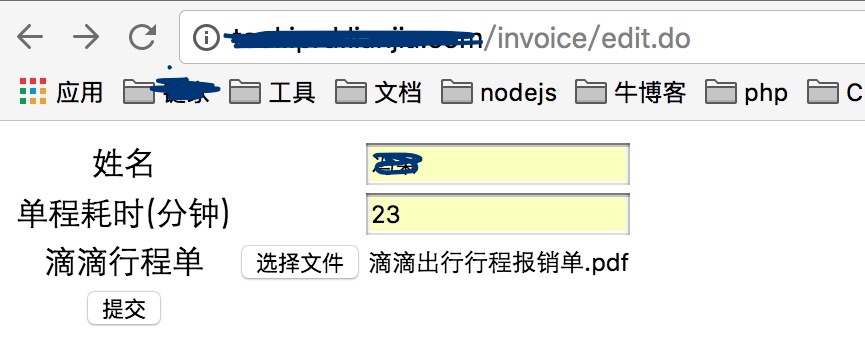

滴滴出行行程单转 Excel
===

### 导语
我们报销滴滴打车票，较为繁琐，步骤为：

1. 使用滴滴客户端提交行程报销单（不知怎么用的请百度）。
2. 收到 pdf 版电子行程单。
3. 收到此次报销行程的增值税发票（申通快递送达）。
4. 用公司 Excel 模板记录行程（copy pdf 报销单）。
5. 粘贴发票和打印行程单给报销接口人，发送包含 Excel 的电子邮件给报销接口人。

其中步骤1为滴滴客户端操作，非常便捷。步骤 2、3 为滴滴公司操作，个人不可控。步骤4为员工自己操作，非常耗时。步骤5为结果提交行为，很便捷。可见报销过程中步骤4最为繁琐，且每次都重复劳动。因此，开发了小工具，解析行程单 pdf，摆脱每次都做的重复劳动。

### 使用步骤

1. 打开工具地址: localhost:8100/invoice/edit.do 
	
2. 按操作导出 Excel。
	- 注意文件大小不能超过 2M。
	- 由于行程单没有结束时间，需要自己设定行程耗时，让程序计算。 
3.	打开导出的 Excel 将内容 copy 到公司模板。 
	- 设置 “金额”、“票据张数” 的单元格格式为 “数字”。
4. 至此转换完成，可以提交了!